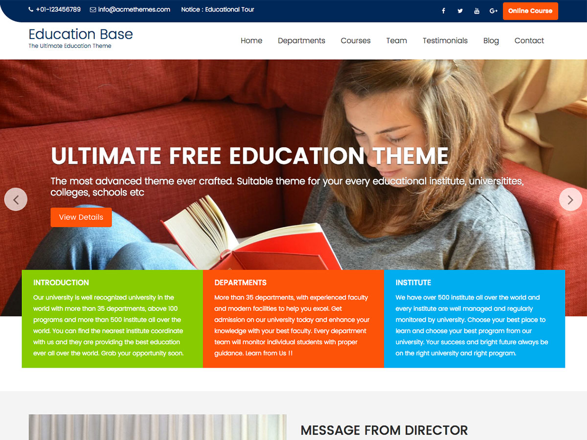

# Education Base

**Contributors:** acmethemes  
**Requires at least:** 6.6  
**Tested up to:** 7.0  
**Requires PHP:** 7.4  
**Stable tag:** 4.0.0  
**License:** GPLv2 or later  
**License URI:** https://www.gnu.org/licenses/gpl-2.0.html  

> 

Education Base is a colorful, modern WordPress theme built for schools, colleges, universities, and educational institutes. It combines an engaging design with powerful features like a notice bar, event calendar widgets, and dedicated course/program layouts — everything you need to connect with students and parents.

## Features

- **Notice bar** — highlight announcements, admissions, and deadlines
- **Featured slider** — showcase campus, events, and programs
- **Up to four-column layouts** — flexible grids for courses and faculty
- **Custom header & background** — brand your institution
- **Drag-and-drop widgets** — arrange content without code
- **Footer widgets** — contact, quick links, and social media
- **Custom colors** — match your school colors
- **Editor-style support** — consistent editing experience
- **Flexible header** — logo, search, and menu options
- **Translation ready** — .pot file included
- **RTL support** — right-to-left language compatible
- **WooCommerce compatible** — sell courses, merchandise, or tickets
- **Responsive & SEO friendly** — works on all devices, ranks well

## Installation

1. Download the theme zip file.
2. In your WordPress admin, go to **Appearance → Themes**.
3. Click **Add New** → **Upload Theme**.
4. Select the zip file and click **Install Now**.
5. Click **Activate**.

## Frequently Asked Questions

### How do I customize the theme?

Go to **Appearance → Customize** to adjust layout, colors, featured content, and widget areas.

### Is there documentation?

Yes — visit the [Education Base documentation](http://www.doc.acmethemes.com/education-base/) for detailed setup guides.

## Credits

Education Base is built on [Underscores](https://underscores.me/) and licensed under GPLv2 or later. It bundles the following third-party resources:

- [Google Fonts](https://fonts.google.com/) — Apache License 2.0
- [Font Awesome](https://fontawesome.com/) — MIT / SIL OFL 1.1
- [normalize.css](https://necolas.github.io/normalize.css/) — MIT
- [Bootstrap](http://getbootstrap.com/) — MIT
- [Theia Sticky Sidebar](https://github.com/WeCodePixels/theia-sticky-sidebar) — MIT
- [Breadcrumb Trail](https://github.com/justintadlock/breadcrumb-trail) — GPLv2+
- [TGM Plugin Activation](http://tgmpluginactivation.com/) — GPLv2+
- [html5shiv](https://github.com/afarkas/html5shiv) — MIT
- [Respond.js](https://github.com/scottjehl/Respond) — MIT

---

[Demo](http://www.demo.acmethemes.com/education-base/) &middot; [Support](https://www.acmethemes.com/supports/) &middot; [Acme Themes](https://www.acmethemes.com)
